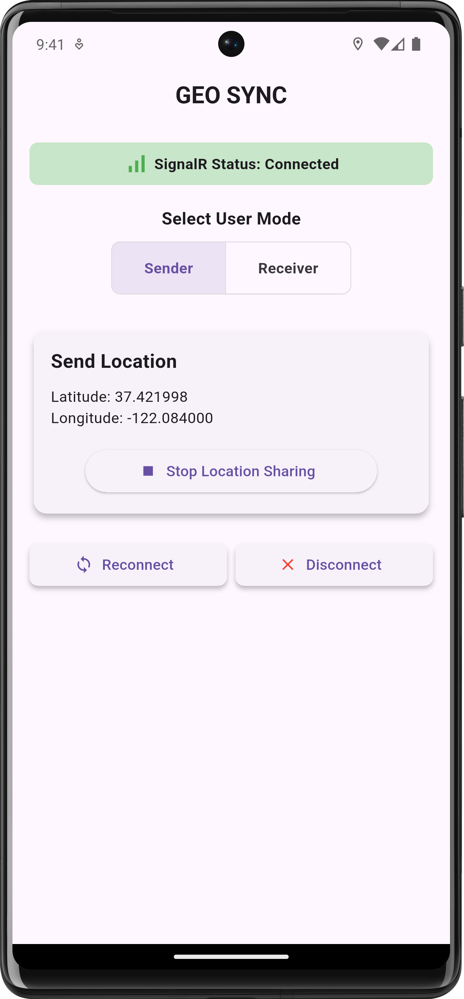
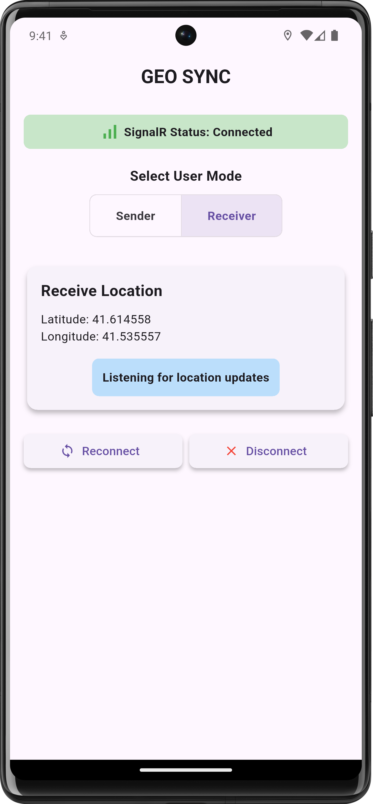

# GEO SYNC

GEO SYNC is a Flutter-based application that uses SignalR for real-time communication. It allows users to share and receive live location updates seamlessly. The app supports two user modes:

- **Sender**: Sends real-time location updates (latitude and longitude) to a SignalR server.
- **Receiver**: Receives and displays location updates sent by Other User.

## Features

- Real-time location sharing using SignalR.
- Two user modes: Sender and Receiver.
- Intuitive UI for toggling user modes and displaying connection status.
- Integration with GPS services for accurate location data.

## Screenshots

## Screenshots

<table>
  <tr>
    <td></td>
    <td></td>
  </tr>
  <tr>
    <td align="center">Sender</td>
    <td align="center">Receiver</td>
  </tr>
</table>

## Getting Started

Follow these steps to set up and run the project:

### Prerequisites

- Flutter SDK installed on your system.
- Dart language support.
- SignalR server for real-time communication.

### Installation

1. Clone the repository:
   ```bash
   git clone <https://github.com/farhansadikgalib/geo_sync>
   cd geo_sync
